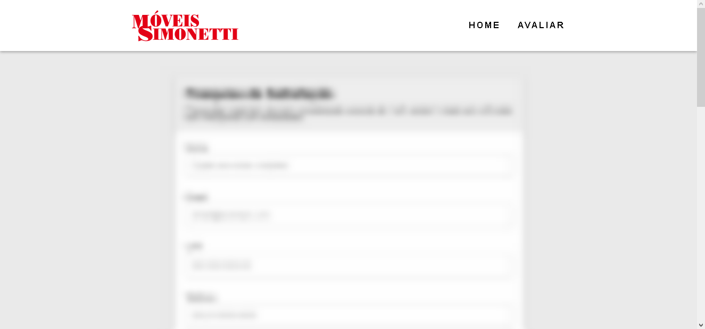
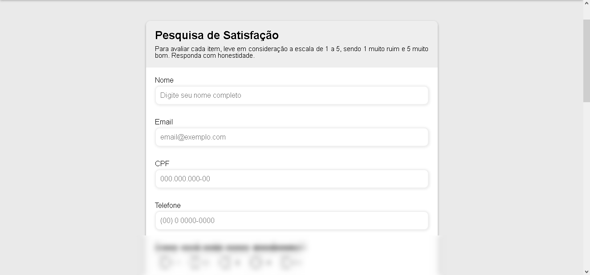
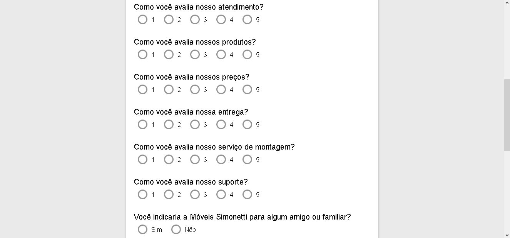
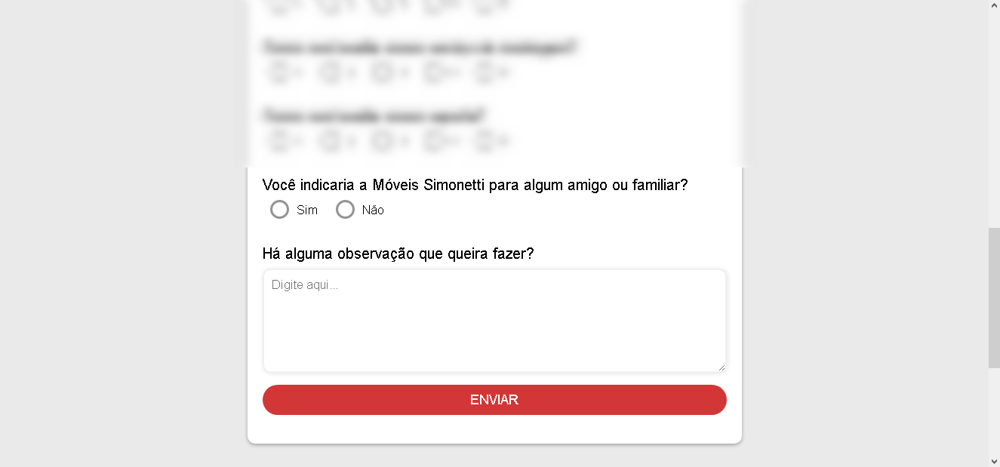
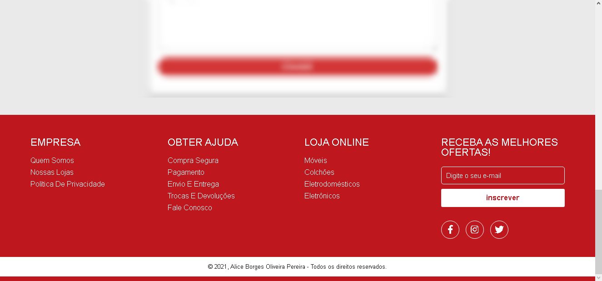

<div align="center">
    
    <h1>Aplicação MSCode - Pesquisa de Satisfação</h1>
</div>

### Índice
* [Escopo do Projeto](#escopo-do-projeto)
    * [Links](#links)
* [Tecnologias Utilizadas](#tecnologias-utilizadas)
    * [HTML5](#html5)
    * [CSS](#css)
    * [JavaScript](#javascript)
* [Visualização](#visualização)
    * [Cabeçalho](#cabeçalho)
    * [Pesquisa](#pesquisa)
    * [Rodapé](#rodapé)
* [Árvore de Arquivos](#árvore-de-arquivos)

## Escopo do Projeto
Este projeto visa se adequar a proposta para o teste de conhecimento do MSCode da Móveis Simonneti. No qual foi solicitado uma aplicação para a ocorrência de uma pesquisa de satisfação, de modo que a mesma seja respondida pelos clientes da Móveis Simonetti.

### Links
* Repositório: https://github.com/borgesalice/mscode-teste
* Deployment: https://borgesalice.github.io/mscode-teste/

## Tecnologias Utilizadas
|Tecnologia|Extensão|Descrição|
|-|-|-|
|[HTML5](#html5)|.html|HTML (Linguagem de Marcação de Hipertexto) é o código usado para estruturar uma página web e seu conteúdo.|
|[CSS](#css)|.css|CSS (Folha de Estilo em Cascata) é o código que você usa para dar estilo à sua página Web. O CSS permite aplicar estilos seletivamente a elementos em documentos HTML.|
[JavaScript](#js)|.js|JavaScript é uma linguagem de programação que permite implementar itens complexos em páginas web mostrando conteúdo que se atualiza em um intervalo de tempo, mapas interativos ou gráficos 2D/3D animados, etc.|

### HTML5
O HTML em si é divido em duas partes, primeiramente, dentro do corpo do HTML, encrontramos as tags `<head>` e `<body>`, que ficam dispostas da seguinte maneira:

```html
<!DOCTYPE html>
<html>
    <head>
        <!--- Aqui encontramos todo o código de configurações do site,
        contendo ainda links para arquivos externos como o CSS. --->
    </head>

    <body>
        <!--- No body estará todo o conteúdo da página - aquilo que visualizamos
        no navegador por exemplo. --->
    </body>
</html>
```

Para a construção da página (`<body>`), essa foi dividida em três partes, sendo elas: cabeçalho (`<head>`), pesquisa (`<main>`) e rodapé (`<footer>`). [Clique aqui](#visualização) para visualizar cada seção do site.

### CSS
Os códigos CSS podem ser adicionado diretamente nas tags `<style>` ou através de um arquivo externo importado através de um link - esse localizado dentro da tag `<head>` do HTML - como citado antes. Na página foram utilizadas diversas funcionalidades do CSS para dar estilo ao site, temos como exemplo o menu responsivo para dispositivos móveis, estilizado a partir do seguinte código:

```css
media (max-width: 999px) {
  body {
    overflow-x: hidden;
  }
  .nav-list {
    position: absolute;
    top: 15vh;
    right: 0;
    width: 50vw;
    height: 92vh;
    background: #fff;
    flex-direction: column;
    align-items: center;
    justify-content: space-around;
    transform: translateX(100%);
    transition: transform 0.3s ease-in;
  }
  .nav-list li {
    margin-left: 0;
    opacity: 0;
  }
  .mobile-menu {
    display: block;
  }
```

O trecho de código acima foi retirado do arquivo _style.css_ do projeto e aplica estilo específicamente ao menu lateral criado para maior responsividade em dispositivos móveis.

Na criação do menu lateral havia a necessidade do mesmo permanecer invisível durante a navegação do site e se tornar visível, apenas, quando existisse a ação de _click_ no ícone do menu. Para atender esse requisito foi usado `overflow-x: hidden`, determinando que, tudo que for renderizado além das "bordas" esquerda ou direita, será ocultado.

Podemos ainda observar várias linhas que são extremamente utilizadas na estilização dos sites: `margin-left: 0` que aplica margem à esquerda do objeto e `opacity: 0` que determina a opacidade do objeto. Outras linhas que comumente são utilizadas no CSS são `width: 50vw` e `height: 92vh` que determinam o tamanho do objeto manipulado.

### JavaScript
De modo geral o JavaScript é uma linguagem de programação que permite a criação de funções dentro de uma aplicação podendo utilizar parâmetros específicos para que elas ocorram. No projeto foram usadas funções para analizar e validar o conteúdo escrito nos _inputs_ da seção de [identificação do cliente](identificação-do-cliente) da pesquisa.

Abaixo observamos um trecho do código da função citada acima:

```js
// função para validar (ou não) os inputs
function checkInputs() {
  const usernameValue = username.value;
  const emailValue = email.value;
  const cpfValue = cpf.value;
  const cellphoneValue = cellphone.value;

  if (usernameValue === "") {
    setErrorFor(username, "O nome é obrigatório.");
  } else {
    setSuccessFor(username);
  }
```

Com o `if` determinamos os parâmetros a serem analizados e ainda definimos uma ação a ser realizada. No trecho citado o parâmetro `usernameValue` corresponde ao conteúdo escrito no input de "Nome", o qual é identificado pelo `id="username"`. Já a função que definimos é `setErrorFor` que deve ser acompanhada do seu "alvo" e a mensagem que aparecerá, neste caso `setErrorFor(username, "O nome é obrigatório")`.

Para o restante dos inputs, seguimos a mesma estrutura de código, alterando apenas o necessário para corresponder as necessidades de cada input.

```js
// colocar automaticamente os caracteres extras no input cpf
function mascaracpf(cpf) {
  if (cpf.value.length == 3) cpf.value = cpf.value + ".";
  if (cpf.value.length == 7) cpf.value = cpf.value + ".";
  if (cpf.value.length == 11) cpf.value = cpf.value + "-";
}
```
Com o parâmetro `cpf.value.length == 3` determinamos que se a quantidade de caracteres do _value_ do input "CPF" for igual a 3 será adicionado um "." após os mesmos. O mesmo acontece no restante dos parâmetros. Essa função foi criada para, enquanto sendo digitado, será adiocionado automáticamente a pontuação padrão do CPF. Essa função foi definida também para o input de "Telefone" apenas sendo adaptada para as necessidades do mesmo.

## Visualização
### Cabeçalho
No cabeçalho da página observamos a logo da empresa juntamente com duas seções de navegação: **home** que leva à página inicial da loja online e **avaliar** que corresponte a página de formulário de satisfação.




### Pesquisa
Na seção de pesquisa identificamos 3 partes principais, sendo elas:

**Identificação do cliente:**




**Perguntas objetivas:**




**Observações e envio:**




### Rodapé
A parte final do site (rodapé) contém links funcionais que direcionam para páginas externas do próprio site da Móveis Simonetti, bem como uma área para inscrição na "newlester". Ainda foi adicionado uma linha constando o copyright.


## Árvore de Arquivos
```
├── assets
|   └── css
|   |   └── reset.css
|   |   └── style.css
|   |
|   └── img
|   |   └── favicon.webp
|   |   └── header-logo.png
|   |
|   └── js
|   |   └── navbar.js
|   |   └── script.js
|   |
|   └── readme-img
|       └── cabecalho.png
|       └── pesquisa_1.png
|       └── pesquisa_2.png
|       └── pesquisa_3.png
|       └── rodape.png
|
├── index.html
└── README.md
```

<div aling="center">
    <h4>Made with 💙 by Alice Borges | 😁</h4> <h4 href="https://www.linkedin.com/in/alice-borges-703a55244/">See my LinkedIn</h4>
</div>
